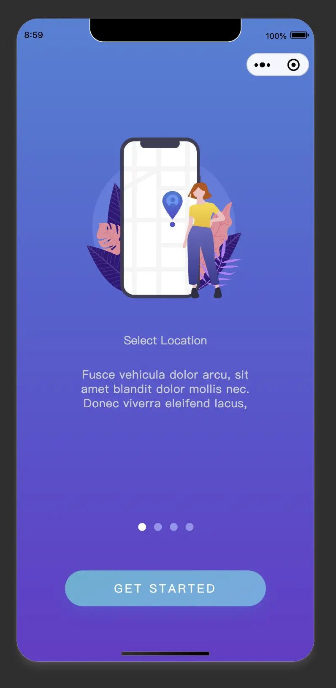
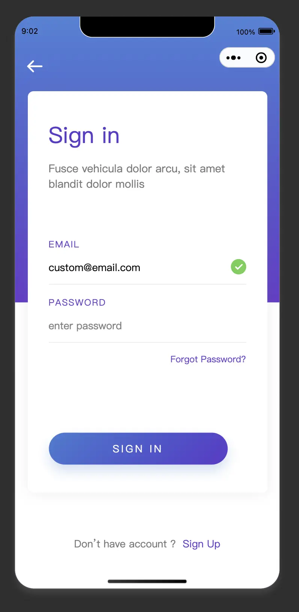
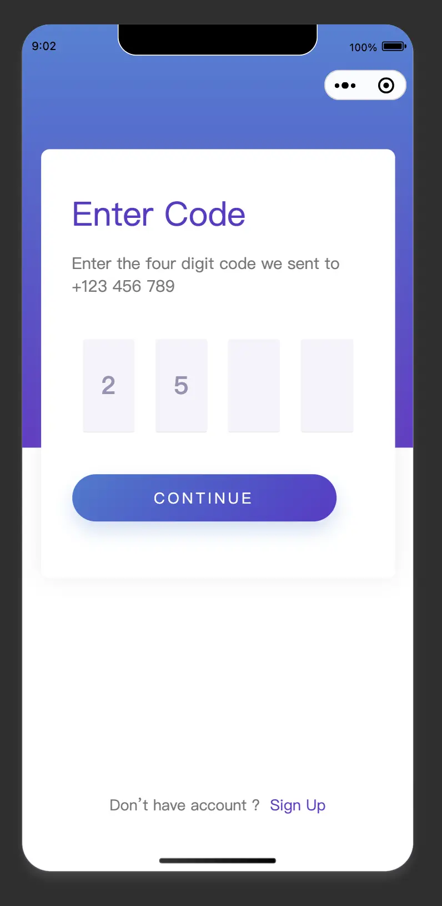
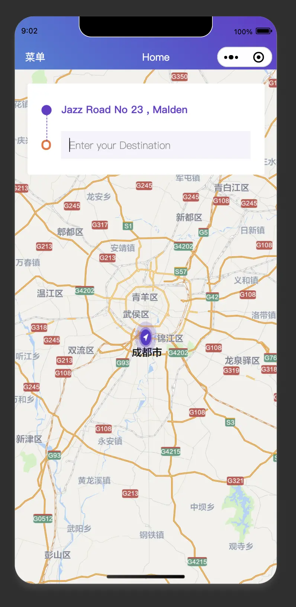
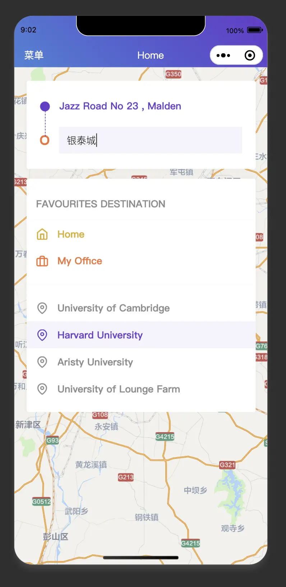
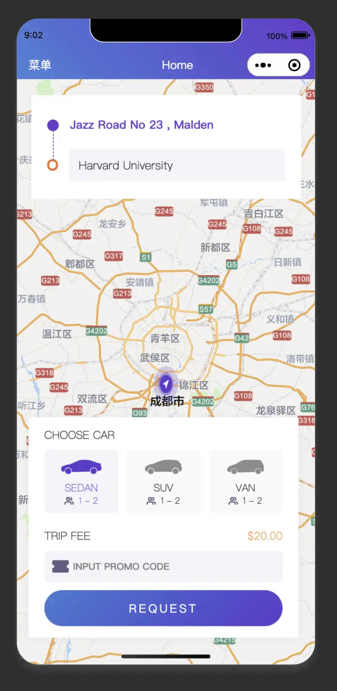
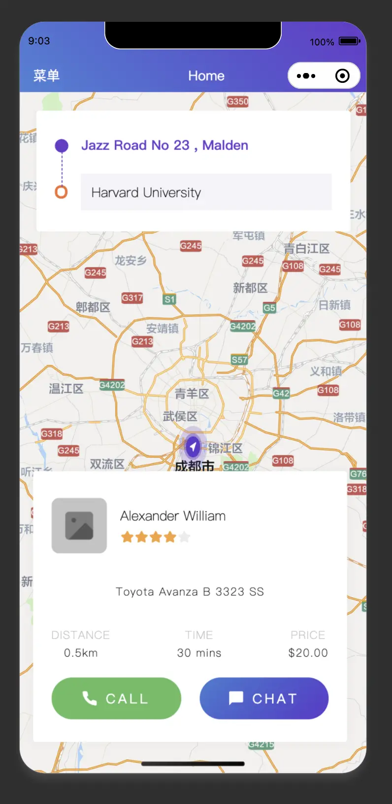
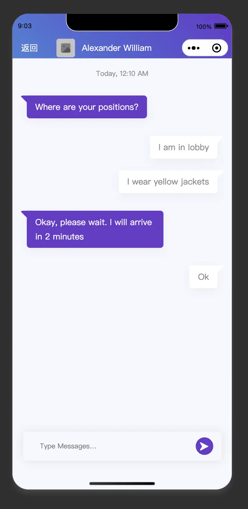
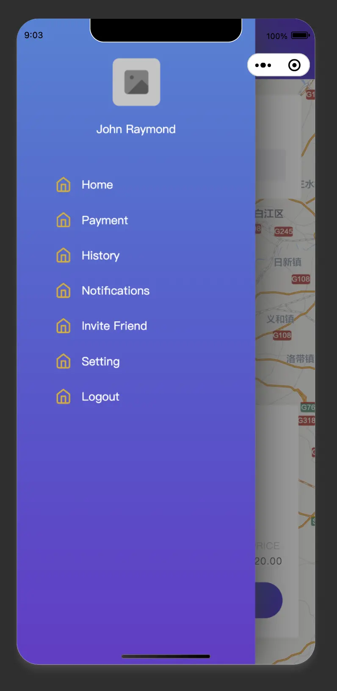

<!--
 * @Descripttion: your project
 * @version: 0.0.0
 * @Author: Minyoung
 * @Date: 2022-05-10 08:56:56
 * @LastEditors: Minyoung
 * @LastEditTime: 2022-05-10 09:29:43
-->
# 快喵打车基础展示
> 大量逻辑需要联合数据实现，感兴趣的朋友可以自行扩展。

## 基础页面展示

  
  
  
  
  
  
  
  
  
  

## 开发环境
+ node v14.16.1
+ 开发工具 HBuilder X 3.3.13.20220314
+ Vue 2.x

## 提示
微信小程序id切勿商用，如需升级上线，自行替换自己的小程序id。